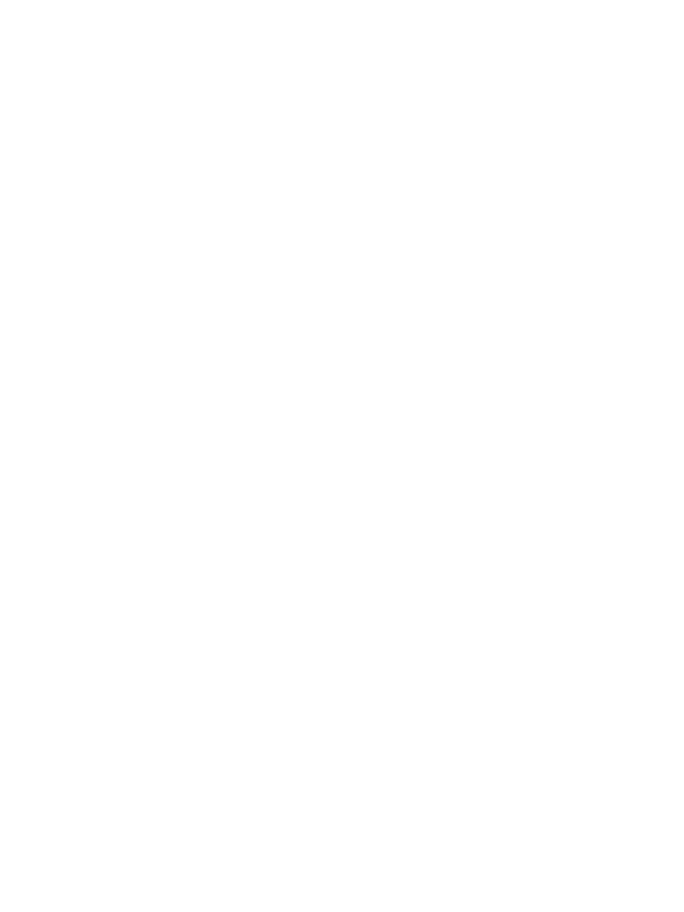
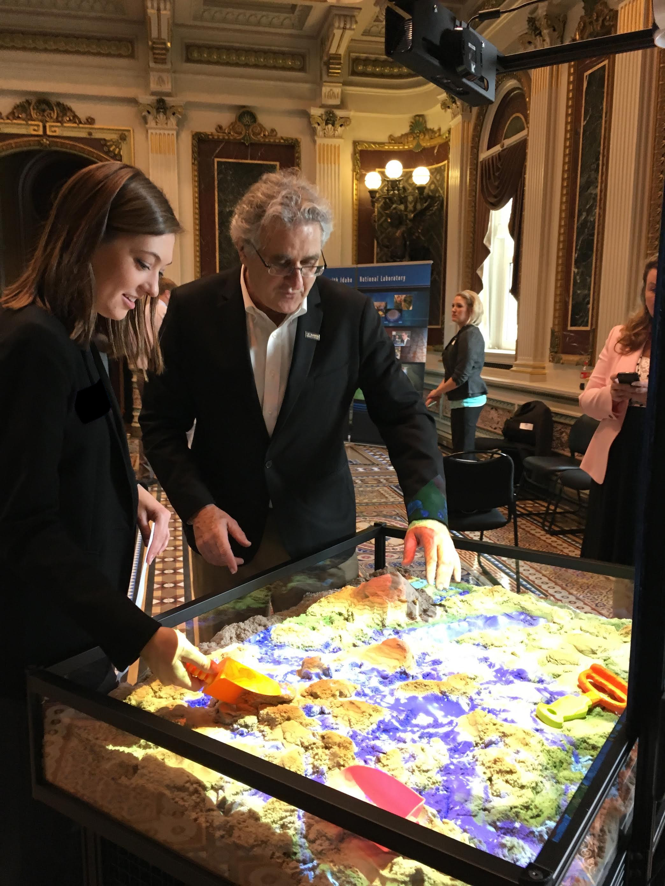

\newpage

# Roteiro: do zero ao funcionando

Esse capítulo é o **passo a passo completo** pra montar uma Caixa de Areia do zero. Cada etapa aponta pro capítulo de detalhes correspondente. Siga **na ordem** — pular etapas geralmente quebra a próxima.

**Tempo total estimado**: 1 a 2 dias (a parte longa é montar o suporte físico e fazer a calibração com cuidado; o software roda em 30 minutos).

## Etapa 1 — Comprar/separar os materiais

Lista de hardware necessário. **Tudo precisa estar em mãos antes de começar** (ver detalhes no capítulo *[Materiais e Montagem](#materiais-e-montagem)*):

- [ ] Kinect Xbox 360 v1 + adaptador USB/energia
- [ ] Projetor com resolução nativa 4:3 e entrada HDMI
- [ ] Computador com Linux compatível, GPU dedicada (GTX 1060+ recomendada), 4 GB+ RAM
- [ ] Caixa retangular ~100×75×25 cm
- [ ] Suporte metálico pro Kinect e projetor
- [ ] Areia fina atóxica (suficiente pra encher a caixa em 15-20 cm)
- [ ] Cabos: USB longo, HDMI, energia

**Checkpoint:** todos os itens fisicamente em mãos antes de prosseguir.

## Etapa 2 — Montar a caixa e o suporte

Detalhes em *[Materiais e Montagem](#materiais-e-montagem)*.

1. Monte a caixa de madeira/MDF respeitando a proporção ~4:3:1 (recomendado: 100×75×25 cm).
2. Encha com areia até **15-20 cm de profundidade** — deixe espaço suficiente pra mexer sem expor o fundo.
3. **Achate a areia** com uma régua grande (precisa estar bem plana pra calibração funcionar).
4. Monte o suporte metálico de modo que ele permita prender Kinect e projetor **acima da caixa**.

**Checkpoint:** caixa pronta, areia achatada e nivelada, suporte instalado e estável.

## Etapa 3 — Posicionar Kinect e projetor

Esse é o passo mais técnico — detalhes em *[Altura e alinhamento](#altura-e-alinhamento-o-que-estava-errado-no-manual-antigo)*.

1. Prenda o **Kinect** acima do **centro** da caixa, apontado **perpendicularmente pra baixo**.
   - Altura sobre a areia: **~92 cm** se a caixa tem 100 cm de largura (ajustar pela tabela do capítulo).
2. Prenda o **projetor** acima da caixa também, paralelo à superfície.
   - Altura depende do *throw ratio* do projetor (consulte o manual dele).
   - **Não use keystone do projetor** — o SARndbox faz a correção via software.
3. Conecte o Kinect ao computador (USB + energia). Conecte o projetor (HDMI).

**Checkpoint:** Kinect aceso (LED verde), projetor mostrando a área de trabalho do Linux **sem distorção trapezoidal** sobre a areia.

## Etapa 4 — Instalar o sistema operacional e o software

Detalhes em *[Instalação](#instalação)*.

1. Instale Ubuntu 24.04 LTS no computador (siga *Instalação do Linux*).
2. Abra o terminal (Ctrl+Alt+T) e clone o repositório:
   ```bash
   sudo apt install -y git
   git clone https://github.com/ColmeiaUDESC/Kinect-Livre.git
   cd Kinect-Livre/caixa-de-areia
   bash install.sh
   ```
3. Espere terminar (~30 min). Vai pedir sua senha no início.

**Checkpoint:** mensagem `Instalação concluída.` no final do script. Sem erros vermelhos no meio.

## Etapa 5 — Calibração 1: plano base da areia

Detalhes em *[Etapa 1: Plano base](#etapa-1-plano-base)*.

1. Confira que a areia continua bem achatada.
2. Abra terminal e rode:
   ```bash
   cd ~/src/SARndbox-2.8
   RawKinectViewer -compress 0
   ```
3. Use o menu (botão direito) → **Average Frames** (espera 5 segundos).
4. Binde a tecla `1` à ferramenta **Extract Planes**.
5. Segura `1`, arrasta o mouse de um canto da areia até o oposto, solta.
6. **Copia a linha** que aparece no terminal (algo como `Camera-space plane equation: ...`).
7. Edita pra ficar no formato `(x, y, z), offset` e cola na **linha 1** do `~/src/SARndbox-2.8/etc/SARndbox-2.8/BoxLayout.txt`.

**Checkpoint:** primeira linha do `BoxLayout.txt` preenchida.

## Etapa 6 — Calibração 2: cantos da caixa

Continuando no mesmo `RawKinectViewer`. Detalhes em *[Etapa 2: Cantos da caixa](#etapa-2-cantos-da-caixa)*.

1. Binde a tecla `2` à ferramenta **Measure 3D Positions**.
2. Aperte `2` em cada canto **interno** da caixa, nesta ordem:
   - Inferior esquerdo → inferior direito → superior esquerdo → superior direito
3. Copia as 4 linhas que aparecem no terminal e cola nas **linhas 2 a 5** do `BoxLayout.txt`.
4. Salva o arquivo. Fecha o `RawKinectViewer`.

**Checkpoint:** `BoxLayout.txt` com 5 linhas — 1 do plano base + 4 dos cantos.

## Etapa 7 — Calibração 3: projetor

Etapa mais demorada (~30 min). Detalhes em *[Etapa 3: Projetor](#etapa-3-projetor)*.

1. Pegue um **alvo circular** (CD ou disco rígido com duas linhas pretas perpendiculares marcadas).
2. Abra terminal e rode:
   ```bash
   CalibrateProjector -s 1024 768
   ```
   (Troque `1024 768` pela resolução nativa do seu projetor.)
3. Aguarde a tela vermelha por ~4 segundos (captura do fundo — não toque na areia).
4. Binde duas teclas: `1` (capturar ponto) e `2` (recapturar fundo se errar).
5. Pra cada cruz branca projetada (são 12 no total):
   - Posicione o alvo, **paralelo à areia**, na altura sugerida pela cruz.
   - Alinhe as linhas do alvo com a cruz.
   - Tire as mãos da cena.
   - Aperte `1`. Espera 2 segundos. Próximo ponto.
6. No final, confira o **RMS** no terminal — deve ser < 5 pixels.

**Checkpoint:** arquivo `~/src/SARndbox-2.8/etc/SARndbox-2.8/ProjectorMatrix.dat` criado. RMS < 5.

## Etapa 8 — Primeiro teste

1. Rode o SARndbox:
   ```bash
   ~/src/SARndbox-2.8/RunSARndbox.sh
   ```
2. O projetor deve mostrar **cores sobre a areia** alinhadas com o relevo real.
3. Mexa em uma área da areia — as cores devem mudar **em tempo real** acompanhando o relevo.
4. Coloque a mão aberta acima da areia — **deve começar a chover** no ponto da mão (água azul aparecendo).
5. Aperte `Esc` pra sair.

**Checkpoint final:** cores alinhadas + relevo respondendo + chuva funcionando = ✅ caixa pronta.

## Quando re-calibrar

Você **não precisa** repetir as Etapas 1-4. Mas precisa repetir **Etapas 5, 6 e/ou 7** se:

| Aconteceu                                         | Re-calibra            |
|---------------------------------------------------|-----------------------|
| Moveu o Kinect (mesmo um pouco)                   | Etapas 5, 6 e 7       |
| Moveu o projetor                                  | Só Etapa 7            |
| Esbarrou forte no suporte / caixa caiu            | Etapas 5, 6 e 7       |
| Trocou de computador (mas Kinect/projetor no lugar) | Nenhuma (BoxLayout.txt e ProjectorMatrix.dat são portáveis se você copiar) |
| Recarregou areia / mudou nível de areia significativamente | Etapa 5 (só refazer o plano base) |

\newpage

# Sobre

> **Nota:** Esse capítulo tem informações técnicas para futuros membros do Colmeia que vão trabalhar no projeto Kinect Livre. A leitura é recomendada para quem quer entender o projeto além do uso direto. Se você só quer montar e usar, pode pular pro capítulo *Materiais e Montagem*.

## SARndbox

A *Caixa de Areia com Realidade Aumentada* é baseada no projeto **SARndbox**, desenvolvido pelo grupo de pesquisa KeckCAVES da UC Davis (Califórnia). O projeto original está hospedado em [web.cs.ucdavis.edu/~okreylos/ResDev/SARndbox/](https://web.cs.ucdavis.edu/~okreylos/ResDev/SARndbox/).

O SARndbox é escrito em **C++ com OpenGL** e usa o **Vrui Toolkit** (também do KeckCAVES) como camada de abstração de realidade virtual. Toda a renderização em tempo real — superfície da areia, simulação de água, projeção mapeada — usa shaders rodando na GPU.

Versões usadas nesse projeto:

| Componente   | Versão     | Observação                             |
|--------------|------------|----------------------------------------|
| Vrui         | 8.0-002    | Patch OpenAL aplicado pra Ubuntu 22.04+ |
| SARndbox     | 2.8        | Pareada com Vrui 8.0                   |
| Driver Kinect| 3.10       | Suporta Kinect v1 e v2                 |
| libdc1394    | 22 (2.2.5) | Vendorada como `.deb`                  |

## Kinect

O Kinect é um sensor de movimentos lançado pela Microsoft em 2010 como acessório do Xbox 360. Contém:

- **Câmera RGB** colorida convencional, resolução 640×480
- **Sensor de profundidade infravermelho** (canhão IR emissor + receptor), resolução 320×240
- **Array de 4 microfones** direcionais
- **Motor de rotação vertical**

O sensor de profundidade funciona projetando uma **nuvem de pontos de infravermelho** sobre a cena. O receptor mede o padrão de espalhamento dos pontos e o software estima a distância de cada ponto à câmera com base na deformação do padrão. Como o Kinect emite IR com intensidade muito maior que a luz visível, ele funciona em ambientes escuros — mas **não funciona bem sob luz solar direta**, porque o sol também emite muito infravermelho que satura o sensor.

**Limites operacionais do Kinect v1:**

| Parâmetro                    | Valor                    |
|------------------------------|--------------------------|
| Distância mínima             | ~50 cm                   |
| Distância máxima útil        | ~3,5 m                   |
| Distância ótima pra caixa    | 90–110 cm                |
| Campo de visão (FOV) horizontal | ~57°                  |
| FOV vertical                 | ~43°                     |
| Frame rate                   | 30 FPS                   |

Modelos compatíveis usados pelo projeto: **Kinect 1414**, **Kinect 1473**, e **Kinect for Windows v1**. O Kinect v2 (Xbox One) funciona mas é experimental.

\newpage

# Materiais e Montagem

## Componentes

- **Sensor Kinect Xbox 360 v1** (modelo 1414 ou 1473) + adaptador USB/energia
- **Projetor digital** com resolução **nativa 4:3** (ex: 1024×768, XGA) e entrada HDMI
- **Computador** com placa de vídeo dedicada (mínimo GTX 1060 recomendada), 4 GB RAM, processador Intel Core i5 ou equivalente
- **Caixa retangular** com proporção ~4:3:1 (largura : profundidade : altura)
- **Suporte mecânico** pra Kinect e projetor (estrutura metálica é mais durável)
- **Areia** fina, atóxica (areia infantil ou de modelagem)

{width=70% .center}

## Especificação detalhada da geometria

A **proporção 4:3:1** vem do FOV do Kinect: ele "vê" uma área retangular com proporção 4:3, e a profundidade da caixa (1) precisa permitir manipular areia sem expor o fundo.

**Dimensões típicas usadas pelo projeto original:**

| Eixo                    | Medida típica         | Faixa aceitável            |
|-------------------------|-----------------------|----------------------------|
| Largura da caixa        | 100 cm                | 80–120 cm                  |
| Profundidade da caixa   | 75 cm                 | 60–90 cm                   |
| Altura das paredes      | 25 cm                 | 20–30 cm                   |
| Profundidade de areia   | 15–20 cm              | mínimo 10 cm               |

A profundidade da areia precisa ser suficiente pra dar pra "cavar" sem chegar ao fundo da caixa. Se a profundidade for menor que ~10 cm, a calibração do SARndbox vai funcionar mal nas regiões mais baixas.

\newpage

## Altura e alinhamento — **o que estava errado no manual antigo**

> 🚨 **Importante:** o manual antigo dizia que Kinect e projetor "devem estar a uma altura similar ao lado maior da caixa". Isso está **errado por dois motivos**:
>
> 1. Kinect e projetor têm geometrias diferentes — não devem ficar na mesma altura.
> 2. A altura do Kinect depende do FOV dele e do tamanho da caixa, não do lado da caixa.

### Kinect — altura e ângulo

O Kinect deve ficar **centralizado sobre a caixa**, apontado **perpendicularmente pra baixo** (eixo Z apontando pro chão). A altura ideal sobre a superfície da areia é:

$$h_{kinect} = \frac{largura\_caixa}{2 \cdot \tan(28.5°)} \approx largura\_caixa \cdot 0{,}92$$

| Largura da caixa | Altura Kinect (acima da areia) |
|------------------|-------------------------------|
| 80 cm            | ~74 cm                        |
| 100 cm           | **~92 cm**                    |
| 120 cm           | ~110 cm                       |

**Critério visual de validação:** rode `RawKinectViewer -compress 0` na fase de calibração — a imagem de profundidade deve cobrir **exatamente** os quatro cantos da caixa. Se aparecer área fora da caixa, o Kinect está alto demais; se cortar cantos, está baixo demais ou desalinhado.

{width=70% .center}

### Projetor — altura, ângulo e foco

O projetor é mais complicado que o Kinect porque depende do **throw ratio** do modelo (relação distância:largura projetada).

**Regras gerais:**

1. **Alinhamento**: a face do projetor deve ficar **paralela à superfície da areia**, projetando perpendicularmente pra baixo.
2. **Cobertura**: a área projetada precisa **bater com a área que o Kinect vê** (ou cobrir um pouco a mais — o SARndbox descarta o excesso).
3. **Foco**: focalize no **plano médio da areia achatada**, não no fundo da caixa nem nas bordas.
4. **Resolução**: use a **resolução nativa do projetor** (1024×768 pra XGA). Não force outras resoluções pelo Linux.
5. **Keystone**: ⚠️ **NUNCA use a correção de keystone do projetor**. O SARndbox tem seu próprio sistema de correção via `ProjectorMatrix.dat` — se o projetor pré-corrigir, a calibração fica errada.

**Como descobrir a altura do projetor:** consulte o manual dele pelo *throw ratio*. Exemplo: throw ratio de 1.5 com caixa de 100 cm de largura → projetor a 150 cm acima da areia.

**Projetores com offset (short-throw)**: alguns projetores projetam para cima/baixo do eixo da lente (chamado *off-axis projection* ou *projeção descentralizada*). Nesses casos, monte o projetor **deslocado lateralmente** da caixa, não acima do centro — siga as instruções do fabricante pra que a imagem fique centralizada.

**Validação visual**: depois de fixado, projete uma imagem branca cheia. Ela deve aparecer como **retângulo** na areia achatada (não trapézio). Se aparecer trapézio, ajuste o ângulo do projetor — não use keystone.

\newpage

## Suporte mecânico

O suporte é a peça mais subestimada do projeto. Recomendações:

- **Material**: aço ou alumínio. MDF/madeira tendem a empenar com umidade.
- **Estabilidade**: o suporte vai ser esbarrado por crianças e adultos. Vibrações descalibram o sistema (precisa recalibrar).
- **Acessibilidade**: deixe espaço pra acessar o cabo USB do Kinect sem desmontar nada.
- **Cabos**: passe os cabos por dentro de eletrodutos ou abraçadeiras. Cabos soltos puxam o Kinect e quebram a calibração.
- **Rodízios**: se a caixa for ser movida, use rodízios com **trava**. Mover sem travar descalibra.

{width=70% .center}

\newpage

# Instalação

> **Pré-requisito:** Ubuntu 24.04 LTS instalado (ou compatível). Ver seção *Sistema operacional* abaixo se precisar instalar.

## Sistema operacional

**Recomendado:** Ubuntu 24.04 LTS (Noble Numbat). Funciona também em Linux Mint 21.x.

> 💡 **WSL2 (Windows)**: serve pra **desenvolvimento** (compilar, mexer no código), mas **não pra uso real** com Kinect. O WSL não enxerga USB nativamente — precisa do `usbipd-win` e mesmo assim a latência atrapalha. Pra exposição/uso, sempre Linux nativo.

**Não funciona:**
- Versões muito antigas (Ubuntu < 20.04) — bibliotecas incompatíveis
- macOS / Windows nativo — projeto é Linux-only
- Máquina virtual sem passthrough de USB e GPU dedicada

## Instalação do Linux (se ainda não tiver)

1. Baixe a ISO do [Ubuntu 24.04 LTS](https://ubuntu.com/download/desktop)
2. Crie pendrive bootável com [balenaEtcher](https://www.balena.io/etcher/)
3. Boot pelo pendrive (F2/F12/Del durante boot — varia por fabricante)
4. Siga o instalador: idioma → teclado → particionamento → usuário → reinicia
5. Após reiniciar, abra o terminal (Ctrl+Alt+T) e atualize:

```bash
sudo apt update && sudo apt upgrade -y
```

## Instalação do software da Caixa de Areia

Tudo é feito por um único script. Clone o repositório e dispare:

```bash
sudo apt install -y git
git clone https://github.com/ColmeiaUDESC/Kinect-Livre.git
cd Kinect-Livre/caixa-de-areia
bash install.sh
```

O script:

1. Pede a senha do sudo (uma vez no início)
2. Instala dependências via `apt` — incluindo `fonts-freefont-ttf` que é **obrigatório** (sem ele o Vrui não compila)
3. Instala os `.deb` locais do `libdc1394` (versão 22 — não tem nos repos do Ubuntu 22+)
4. Copia o source vendorado de `vendor/` pra `~/src/` (build local, rápido)
5. Compila e instala **Vrui** em `/usr/local/` (~15 min)
6. Compila e instala o **driver Kinect 3.10** (~2 min)
7. Compila o **SARndbox 2.8** (~3 min)
8. Cria `~/src/SARndbox-2.8/RunSARndbox.sh` e ícone na área de trabalho

**Logs:** tudo fica em `~/caixa-de-areia-install.log`. Se quebrar, manda esse arquivo numa issue.

\newpage

# Calibração

A calibração tem **três etapas** que precisam ser feitas **uma vez** após montar (e refeitas se o Kinect ou o projetor forem movidos):

1. Calibração do **plano base** da areia (BoxLayout.txt — linha 1)
2. Calibração dos **cantos da caixa** (BoxLayout.txt — linhas 2 a 5)
3. Calibração do **projetor** (ProjectorMatrix.dat)

## Etapa 1: Plano base

**Pré-condição:** areia da caixa **completamente achatada** (use uma régua grande).

```bash
cd ~/src/SARndbox-2.8
RawKinectViewer -compress 0
```

Vai abrir uma janela com dois vídeos: profundidade (esquerda, azul/preto) e RGB (direita, colorido). **Use apenas o lado de profundidade.** Navegação: segure `Z` e arraste pra mover, roda do mouse pra zoom.

**Passos:**

1. Menu principal (botão direito) → `Average Frames`. Espera ~5 segundos pra estabilizar.
2. Bind a tecla `1` → "Extract Planes" (clique direito → Tool Selection → atribui).
3. Segure `1` num canto da areia (interno à caixa, não na borda de madeira), arraste até o canto oposto e solte.
4. No terminal aparece algo como:
   ```
   Camera-space plane equation: x * (0.0053, -0.0502, 0.9987) = -115.296
   ```
5. **Edite essa linha**: tire o `x *`, troque o `=` por vírgula. Vai virar:
   ```
   (0.0053, -0.0502, 0.9987), -115.296
   ```
6. Cole essa linha em `~/src/SARndbox-2.8/etc/SARndbox-2.8/BoxLayout.txt` (apague qualquer coisa que tiver lá).

> 💡 **Ajuste fino do "nível do mar"**: depois de tudo calibrado, se o nível 0 da chuva tiver muito alto/baixo, mexa apenas no offset (último número da linha 1). **Aumentar o offset** → eleva o nível do mar. **Diminuir** → abaixa. Cada 10 unidades = 10 cm.

\newpage

## Etapa 2: Cantos da caixa

Continuando no mesmo `RawKinectViewer`:

1. Bind a tecla `2` → "Measure 3D Positions".
2. Aperte `2` em cada **canto interno da caixa** (onde a areia encosta na parede), nessa ordem:
   - Canto **inferior esquerdo** (corner 0)
   - Canto **inferior direito** (corner 1)
   - Canto **superior esquerdo** (corner 2)
   - Canto **superior direito** (corner 3)
   
   *(Como um "Z invertido" — começa em baixo e sobe.)*
3. Cada aperto imprime uma linha no terminal tipo `(  -46.36, -37.74, -117.03 )`.
4. Cole as quatro linhas no `BoxLayout.txt`, logo abaixo da linha do plano base.

**Estado final do BoxLayout.txt:**

```
(0.0053, -0.0502, 0.9987), -115.296
(  -46.3606,  -37.7409, -117.027)
(   32.4776,  -35.279,  -117.351)
(  -47.265,    39.513,  -112.917)
(   28.5548,   41.5887, -113.528)
```

Salva, fecha o `RawKinectViewer`.

## Etapa 3: Projetor

**Pré-condição:** etapas 1 e 2 feitas, projetor montado e ligado.

**Material adicional necessário:**
- Um **alvo circular**: um CD ou disco de papel rígido com **duas linhas pretas perpendiculares** marcadas, cruzando no centro.

```bash
CalibrateProjector -s 1024 768
```

(Substitua `1024 768` pela resolução nativa do seu projetor.)

**Processo:**

1. **Captura de fundo (tela vermelha):** logo no início a tela fica vermelha por ~4 segundos. A areia precisa estar **achatada e intocada** durante esse tempo.
2. **Tool de captura:** bind dois botões — `1` (capturar ponto) e `2` (recapturar fundo, se algo der errado).
3. **Coleta de pontos:** o projetor vai mostrar uma **cruz branca** em pontos diferentes da caixa, e o programa pede que você posicione o alvo circular naquela cruz, em **alturas variadas** (mais perto e mais longe do Kinect). Pra cada ponto:
   - Coloque o disco-alvo na posição da cruz, **paralelo ao plano da areia**.
   - Alinhe as linhas pretas do alvo com a cruz branca projetada.
   - Mantenha sua mão fora da cena.
   - Pressione `1` e espere ~2 segundos. O sistema move pro próximo ponto.
4. Por padrão são **12 pontos** (grade 4×3). Recomendado coletar em **3 alturas diferentes**: 4 pontos perto da areia, 4 a meia altura, 4 mais altos.
5. No final imprime o **RMS residual**. Critério de qualidade: **< 2 pixels é ótimo, < 5 aceitável, > 10 refazer**.

Gera o arquivo `ProjectorMatrix.dat` em `~/src/SARndbox-2.8/etc/SARndbox-2.8/`. Esse arquivo é o que o flag `-fpv` do SARndbox usa.

\newpage

# Uso

## Iniciar o sistema

```bash
~/src/SARndbox-2.8/RunSARndbox.sh
```

O script padrão do Colmeia roda com `-uhm -fpv` (mapa de elevação + projeção corrigida). Pra rodar com argumentos diferentes:

```bash
~/src/SARndbox-2.8/bin/SARndbox -uhm -fpv -wo 1.0 -ws 1.0 5 -wts 320 240 -rs 1.5
```

## Argumentos de linha de comando

O SARndbox tem ~30 argumentos. Os mais úteis pra operação cotidiana:

### Renderização visual

| Flag                       | Descrição                                                | Padrão     |
|----------------------------|----------------------------------------------------------|------------|
| `-uhm [arquivo.cpt]`       | Liga mapa de cores de elevação (default: `HeightColorMap.cpt`) | desligado  |
| `-nhm`                     | Desliga mapa de cores                                    |            |
| `-uhs` / `-nhs`            | Liga/desliga **hillshading** (iluminação de encosta)     | desligado  |
| `-us` / `-ns`              | Liga/desliga **sombras**                                 | desligado  |
| `-ucl [espaçamento_cm]`    | Liga linhas de contorno topográficas (default: 0.75 cm)  | desligado  |
| `-ncl`                     | Desliga linhas de contorno                               |            |
| `-fpv [arquivo.dat]`       | Usa correção de projetor (`ProjectorMatrix.dat`)         | desligado  |

### Simulação de água

| Flag                              | Descrição                                                  | Padrão        |
|-----------------------------------|------------------------------------------------------------|---------------|
| `-ws <velocidade> <max_passos>`   | Velocidade da simulação e máx passos/quadro                | `1.0 30`      |
| `-wts <largura> <altura>`         | Resolução da grade de simulação                            | `640 480`     |
| `-rs <força>`                     | Força da chuva em cm/s                                     | `0.25`        |
| `-rer <min_cm> <max_cm>`          | Faixa de altura em que a chuva cai                         | acima da areia |
| `-evr <taxa>`                     | Taxa de evaporação em cm/s                                 | `0.0`         |
| `-wo <profundidade_cm>`           | Profundidade em que a água fica opaca                      | `2.0`         |
| `-rws` / `-rwt`                   | Renderiza água como superfície geométrica ou textura       | `-rwt`        |

### Geometria/calibração

| Flag                              | Descrição                                                  | Padrão        |
|-----------------------------------|------------------------------------------------------------|---------------|
| `-s <escala>`                     | Fator de escala caixa real → terreno simulado              | `100.0` (1:100) |
| `-er <min_cm> <max_cm>`           | Faixa válida de elevação relativa ao plano base            | mapa de cores |
| `-slf <arquivo>`                  | Caminho do `BoxLayout.txt` customizado                     | `~/src/SARndbox-2.8/etc/SARndbox-2.8/BoxLayout.txt` |
| `-c <índice>`                     | Índice da câmera USB (se tiver mais de um Kinect)          | `0`           |

### Suavização do sinal do Kinect

| Flag                              | Descrição                                                  | Padrão        |
|-----------------------------------|------------------------------------------------------------|---------------|
| `-nas <slots>`                    | Slots de média móvel; latência = `slots × 1/30 s`          | `30` (1 seg)  |
| `-sp <min_amostras> <max_var>`    | Mín. amostras válidas e variância máxima                   | `10 2`        |
| `-he <histerese>`                 | Envelope de histerese pra remover tremulação               | `0.1`         |

### Outros

| Flag                              | Descrição                                                  |
|-----------------------------------|------------------------------------------------------------|
| `-h`                              | Imprime ajuda completa                                     |
| `-cp <caminho>`                   | Cria pipe POSIX pra controle externo (ver seção *Controle por pipe*) |
| `-remote [porta]`                 | Servidor TCP pra streaming dos dados (default: 26000)      |

## Combinações recomendadas

| Cenário                        | Comando                                                              |
|--------------------------------|----------------------------------------------------------------------|
| Padrão (exposição pública)     | `SARndbox -uhm -fpv`                                                |
| Demo com simulação rápida      | `SARndbox -uhm -fpv -ws 2.0 30 -rs 1.5`                              |
| Demo com curvas de nível       | `SARndbox -uhm -fpv -ucl 1.0 -uhs`                                   |
| Performance fraca (laptop)     | `SARndbox -uhm -fpv -wts 320 240 -nas 60`                           |

\newpage

## Controles em tempo real

Quando o SARndbox está rodando, você pode interagir de várias formas.

### Mãos sobre a caixa (automático)

Quando você posiciona uma mão **aberta** sobre a areia (acima dela), o sistema detecta como **fonte de chuva local**. Quanto mais aberta e estável a mão, mais forte a chuva. Esse comportamento é **automático** — não precisa configurar.

**Dicas:**
- A mão precisa estar **a uma altura intermediária** entre a areia e o Kinect.
- Se você for chovendo demais, fechar a mão (forma de punho) corta o efeito.
- Múltiplas mãos = múltiplos pontos de chuva simultaneamente.

### Teclado

| Tecla | Ação                                                |
|-------|-----------------------------------------------------|
| `1`   | (padrão Colmeia) Liga chuva global (em toda caixa)  |
| `2`   | (padrão Colmeia) Para chuva                         |
| `Esc` | Fecha o programa                                    |
| `F11` | Alterna fullscreen                                  |

> ⚠️ **Os binds das teclas `1`, `2` não são padrão do SARndbox** — eles são feitos pela configuração do Vrui que vem com o nosso instalador, atribuindo o `GlobalWaterTool` a essas teclas. Se rodar SARndbox em outra máquina sem essa configuração, esses binds podem ser diferentes.

### Menu

Clique com o **botão direito do mouse** em qualquer lugar da projeção pra abrir o menu Vrui. Itens relevantes:

- **Pause Topography**: congela a leitura do Kinect (a areia não atualiza mais — útil pra "tirar foto" do relevo).
- **Show Water Simulation Control**: abre painel com sliders pra velocidade, passos máximos, atenuação da água em tempo real.

### Ferramentas (Tools)

O SARndbox tem 4 ferramentas configuráveis. Cada uma pode ser bindada a botões/teclas via menu Vrui:

| Ferramenta              | Função                                                         |
|-------------------------|-----------------------------------------------------------------|
| **GlobalWaterTool**     | Chuva/seca global. 2 botões: chuva (segura), seca (segura).      |
| **LocalWaterTool**      | Chuva local com pincel. Mostra cilindro azul indicando alcance.   |
| **DEMTool**             | Carrega DEM (mapa de elevação real, ex: USGS) e sobrepõe à areia.|
| **BathymetrySaverTool** | Salva relevo atual em arquivo (formato USGS DEM).                 |

### Controle por pipe (avançado)

Se rodar com `-cp /tmp/sandbox`, você cria um *named pipe* POSIX onde pode escrever comandos em tempo real:

```bash
# Em outro terminal:
echo "waterSpeed 2.0" > /tmp/sandbox
echo "useContourLines on" > /tmp/sandbox
echo "contourLineSpacing 1.5" > /tmp/sandbox
```

Comandos suportados: `waterSpeed`, `waterMaxSteps`, `waterAttenuation`, `colorMap <arquivo>`, `useContourLines on/off`, `contourLineSpacing <cm>`, `heightMapPlane <x> <y> <z> <offset>`.

\newpage

# Troubleshooting

## "Cannot find Kinect device" ao rodar SARndbox

O Kinect não foi reconhecido. Verifique:

1. Cabo USB conectado.
2. Cabo de energia do Kinect conectado.
3. `lsusb | grep -i microsoft` retorna alguma coisa.
4. Se estiver no WSL: USB não passa por default. Precisa do `usbipd-win` configurado.

## Imagem do Kinect treme/cintila muito

Aumenta a média móvel: `-nas 60` (em vez do default 30). Custo: latência sobe pra ~2 segundos.

## Projeção desalinhada (cores em lugar errado)

A calibração do projetor saiu ruim. Refazer a Etapa 3 (CalibrateProjector). Confira o RMS no final — deve ficar < 2 pixels.

## Cores piscando no terreno

Algum ruído de Kinect chegou direto na renderização. Aumenta a histerese: `-he 0.2`.

## Água some muito rápido / muito devagar

- Sumindo rápido: diminuir `-evr` (ou tirar o flag — default 0 = nada evapora).
- Devagar/empoçando: aumentar `-evr 0.05` (cm/s).

## "make: Clock skew detected" durante o install

Se você rodou o `install.sh` direto da pasta Windows `/mnt/c/...` no WSL, isso é normal — arquivos têm timestamps do Windows. Sem efeito prático no build.

## SARndbox sai logo após abrir, sem mensagem

Geralmente é falta de OpenGL/GPU. Confira se a placa de vídeo é dedicada e tem driver instalado:

```bash
glxinfo | grep "OpenGL renderer"
```

Deve aparecer o nome da sua GPU. Se aparecer "llvmpipe" ou "Mesa software", os drivers não estão funcionando.

\newpage

# Para contribuir

Esse projeto está hospedado em [github.com/ColmeiaUDESC/Kinect-Livre](https://github.com/ColmeiaUDESC/Kinect-Livre).

## Modificar o source

Todo o source-code do Vrui, SARndbox e driver Kinect está em `caixa-de-areia/vendor/`. Edite lá direto.

- **Visualização e simulação**: `vendor/sarndbox/`. Os shaders OpenGL estão em `share/SARndbox-2.8/Shaders/`.
- **Driver Kinect**: `vendor/kinect/`.
- **Framework**: `vendor/vrui/` (raramente precisa mexer).

Após editar:

```bash
cd Kinect-Livre/caixa-de-areia
bash install.sh
```

O script é **idempotente** — só recompila o que mudou. Edição rápida → rebuild em segundos.

## Modificações nossas em relação ao upstream

Estão documentadas no README principal do repo. Resumo:

1. **`vendor/vrui/Vrui/SoundContext.h`**: forward declarations de `ALCdevice`/`ALCcontext` reescritas pra compatibilizar com OpenAL moderno (Ubuntu 22.04+).

Se você adicionar mais modificações ao upstream, documente-as no README.

## Regenerar esse manual

O manual é gerado a partir de `docs/manual.md` via pandoc + xelatex:

```bash
bash docs/build-pdf.sh
```

Pra adicionar uma foto nova, jogue ela em `docs/photos/` (extensão `.jpg` ou `.png`) e referencie no `manual.md` com:

```markdown
{width=70% .center}
```

Os números na frente do nome do arquivo (`01-`, `02-`...) servem só pra ordem visual na pasta.

## Comunidade

[Discord do Colmeia](https://discord.gg/yZZsV4xABZ) — canal específico do projeto Kinect Livre.
